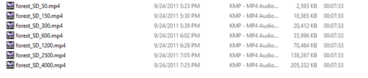

# HTTP2 Live Streaming
HTTP2 Push-Based Low-Delay Live Streaming


## Dependencies

Please download and install Python 3.* from the following site:

[https://www.python.org/downloads/](https://www.python.org/downloads/)

You also need the following modules:

- `hyper-h2`
- `cv2`
- `pickle` (if not available with Python package)

Other modules such as `threading`, `time`, `matplotlib`, and `socket` are typically available with the Python package.

### Module Installation

Ensure you have installed the `pip` module first. For Linux, it is generally included with the Python package. Otherwise, follow the instructions here:

[https://www.tecmint.com/install-pip-in-linux/](https://www.tecmint.com/install-pip-in-linux/)

For Windows, refer to:

[https://github.com/BurntSushi/nfldb/wiki/Python-&-pip-Windows-installation](https://github.com/BurntSushi/nfldb/wiki/Python-&-pip-Windows-installation)

#### Installing Required Modules

- **Hyper-h2**:
  ```bash
  pip install h2
  ```

- **OpenCV**:
  ```bash
  pip install opencv-python
  ```
  or
  ```bash
  pip install opencv-contrib-python
  ```

- **Pickle**:
  ```bash
  pip install pickle-mixin
  ```

## Video Archive

The video archive should contain videos with bitrates 50, 150, 300, 600, 1200, 2500, and 4000. 

### File Naming Convention

The naming format for each video has three parts separated by `_` and the extension, e.g.,


```
<name_of_video>_<resolution_information>_<bitrate>.mp4
```

Example:

```
forest_SD_300.mp4
```

### Download Videos

You can download videos from the following dataset library:

[http://www-itec.uni-klu.ac.at/dash/?page_id=207](http://www-itec.uni-klu.ac.at/dash/?page_id=207)

For simplicity, a video set has been uploaded to Google Drive and can be downloaded from this link: [https://goo.gl/vpnEAd](https://goo.gl/vpnEAd).

## Input Guide / Running Procedure

### For Server

#### Format:

```bash
python h2server.py "PUSH" "PATH INCLUDING NAME OF THE FILE EXCEPT LAST PART" "VIDEO EXTENSION"
```

- **PUSH**: Value between 1 to 3
- **PATH INCLUDING NAME OF THE FILE EXCEPT LAST PART**: Path to the video archive, including the filename without the last part and extension. Video filenames must follow the specific naming format described above.

#### Example:

```bash
python h2server.py 3 "F:\Work\Educational info\Gottingen\Internet Technologies\video_archive\forest_SD" "mp4"
```

### For Client

#### Format:

```bash
python h2client3.py "BUFFER" "MIN_BUFFER" "QUALITY" "AUTO_QUALITY" "SHOW_OUTPUT" "SHOW_VIDEO" "RTT"
```

- **BUFFER**: Value between 1 to 6
- **MIN_BUFFER**: Value between 0 to 5
- **QUALITY**: Ranges from 1 to 7
- **AUTO_QUALITY**: Either 1 or 0. (Always use 1 for this case.)
- **SHOW_OUTPUT**: Either 1 or 0. (Set to 1 to see running statistics.)
- **SHOW_VIDEO**: Either 1 or 0. (Set to 0 for better performance.)
- **RTT**: Values are 0, 100, 200, 300, or 400. (Use 0 for default RTT.)

#### Example:

```bash
python h2client3.py 6 0 3 1 1 0 0
```

#### Running Without Parameters:

```bash
python h2client3.py
```

In this case, the default values are used:

- BUFFER=6
- MIN_BUFFER=0
- QUALITY=3
- AUTO_QUALITY=1
- SHOW_OUTPUT=1
- SHOW_VIDEO=0
- RTT=0

### Output and Post-Run Notes

The client will run for 214 seconds and, at the end, it will write some files to the source directory. These files can be used to generate plots.
